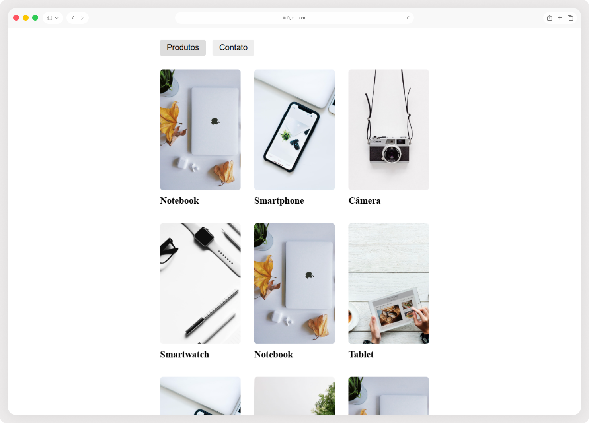

# Catálogo de Produtos 

Aplicação web que consome uma API externa para buscar e exibir produtos em uma listagem, permitindo acessar a página de detalhes de cada item individualmente.

> Status do projeto: Concluído ✔️

## Acesse o projeto 

🔗 [https://roberta-silva.github.io/projeto-react/](https://roberta-silva.github.io/projeto-react/)

## Funcionalidades

- Listagem de produtos consumidos via API externa
- Navegação para a página de detalhes de cada produto
- Roteamento entre páginas com React Router DOM
- Renderização dinâmica dos dados retornados pela API

## Objetivos técnicos

- Componentização e reutilização de elementos com React
- Consumo de API externa com fetch/axios
- Implementação de rotas dinâmicas com React Router DOM
- Gerenciamento e exibição de dados assíncronos
- Organização do projeto seguindo boas práticas de estrutura de pastas

## Tecnologias

- React
- React Router DOM
- JavaScript (ES6+)
- HTML5
- CSS3

## 👀 Preview
 
